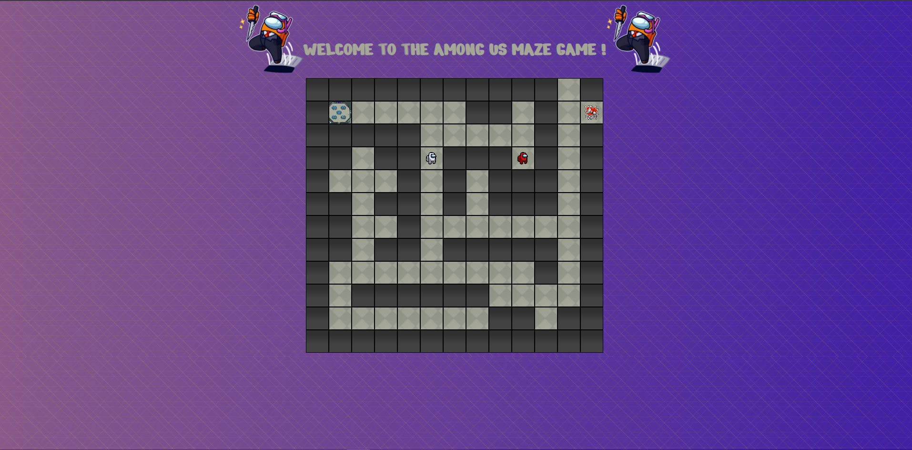

# Amazeing Maze Project

## What ?

The work consists in the creation of a Maze in javascript by following the steps of the repository: [becodeorg/bxl-hopper-1-25](https://github.com/becodeorg/bxl-hopper-1-25/tree/master/The%20Hill/projects/2.amazeing).

## When did i work on it ?

The work was given on Monday 23th November and i finished it on wednesday 25th.

## **Functionalities :**

- creation of a first level maze.
- creation of a player and a ennemy.
- creation of a 'treasure'.
- animation when you die and geta treasure.

### **Functionalities that need improvements :**

- animations doesn't work when i open it with githubPage.

## What does it look like ?

Here is the direct link to the project i made [Among Us MAZE](https://sifedine-hajji.github.io/Maze-Game-AmongUS-/.).

### **What i want to add later**

- ennemy can follow us.
- generate 5 more levels.

#### project screenshot :

## How I Proceeded ?

For the javascript I used all kind of tricks that i learned by making previous projects and followed step by step the repository 'amazeing'.

## License

© Hajji Sifedine
